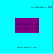
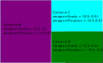

# Camera

Cameras are important parts of the JamJar game engine, they define how the game
world is viewed and rendered. A camera is a
[`Component`](../../reference/classes/component), any entity can be made into a
camera by simply adding a [`Camera`](../../reference/classes/camera) to it.

## Camera World Position

The camera's world position is defined using a
[`Transform`](../../reference/classes/transform) component on the same entity,
with the [`position`](../../reference/classes/transform#position) field
dictating the world position of the entity and therefore the camera.

## Camera Virtual Scale

The camera's virtual scale, specified by the
[`virtualScale`](../../reference/classes/camera#virtualscale) field on the
[`Camera`](../../reference/classes/camera), and is defined in world units. The
virtual scale defines how much of the world the camera is able to see, for
example a virtual scale of `(160, 90)` can see `160` world units wide and `90`
world units tall.



## Camera Viewport

The camera's viewport defines where on the screen/canvas the camera will be
rendered. This is defined with two properties of the
[`Camera`](../../reference/classes/camera),
[`viewportPosition`](../../reference/classes/camera#viewportposition) and
[`viewportScale`](../../reference/classes/camera#viewportscale).
The [`viewportPosition`](../../reference/classes/camera#viewportposition) is the
position of the camera's viewport on the screen, with from the bottom left
`(-1,-1)` to top right `(1,1)` with `(0,0)` as the center.
The [`viewportScale`](../../reference/classes/camera#viewportscale) is the scale
of the camera's viewport, relative to the canvas/rendering surface. A viewport
scale of `(1,1)` would take up the entire canvas, while a scale of `(0.5, 0.5)`
would only take up half of the screen (width and height).



## Example

```typescript
const cameraEntity = new Entity(messageBus);
cameraEntity.Add(new Transform(Vector.New(0, 0), Vector.New(5, 5)));
cameraEntity.Add(new Camera(
    new Color(1, 0, 0, 1), // Red
    Vector.New(0.5, 0.5), // Top right
    Vector.New(0.5, 0.5), // Half width and height of canvas/screen
    Vector.New(160, 90) // 16*9 screen, show 160 * 90 world units
));
```
