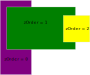

# Primitives

Primitives are renderable components which give greater control over the
rendering process than a [Sprite], can be used to directly render points, lines,
and polygons.

The [PrimitiveSystem] allows rendering [Primitive] components - by tracking
[Primitive] components and generating a list of [IRenderable] for render systems
to use.

## Setting up the Primitive System

To set up a [PrimitiveSystem], you simply need to provide a message bus.

```typescript
new PrimitiveSystem(messageBus);
```

## Peer dependencies

The [PrimitiveSystem] will only work in conjunction with some kind of rendering
system, such as the [WebGLSystem] to actually render the elements; the
[PrimitiveSystem] is a pre-rendering system.

## Creating an entity with a sprite

An [Entity] can be given a primitive by adding the [Primitive] component to an
entity.

```typescript
const primitiveEntity = new Entity(messageBus);
primitiveEntity.Add(new Transform(new Vector(0, 0), new Vector(5,5)));
primitiveEntity.Add(new Primitive(
    new Material(),
    0,
    new Polygon([
        new Vector(0,0.5),
        new Vector(0.5, -0.5),
        new Vector(-0.5, -0.5),
        new Vector(0,0.5)
    ]),
    DrawMode.LINE_STRIP
));
```
This example shows creating an [Entity] which will use the [Primitive] component
to render.

## Z Order

Primitives contain a field [zOrder], which determines the precendence with which
primitives will appear on the screen. Objects with a higher z order will appear
ahead of objects with a lower z order. 



## Material

Primitives specify the [Material] that should be applied when rendering it,
allowing choice over texture, color, and shaders.

## Draw Mode

Primitives contain the field [drawMode], which determines how the [Primitive]
will be drawn - this is a choice of a [DrawMode]. This is the more direct
control over rendering that the [Primitive] has over a [Sprite].

## Creating a UI primitive

A UI primitive can be created by adding a [UI] component to an entity, alongside
required [Transform] and [Primitive] components.

```typescript
const gameCamera = new Entity(messageBus);
gameCamera.Add(new Transform(new Vector(0, 0), new Vector(5, 5)));
gameCamera.Add(new Camera());

const uiElement = new Entity(messageBus);
uiElement.Add(new Transform(new Vector(0, 0), new Vector(0.2,0.2)));
uiElement.Add(new Primitive(
    new Material(),
    0,
    new Polygon([
        new Vector(0,0.5),
        new Vector(0.5, -0.5),
        new Vector(-0.5, -0.5),
        new Vector(0,0.5)
    ]),
    DrawMode.LINE_STRIP
));
uiElement.Add(new UI(gameCamera));
```

This example shows creating a camera, and then a UI primitive that will display
in the center of the camera.

[Sprite]: ../../reference/classes/sprite
[PrimitiveSystem]: ../../reference/classes/primitivesystem
[Primitive]: ../../reference/classes/primitive
[IRenderable]: ../../reference/interfaces/irenderable
[WebGLSystem]: ../../reference/classes/webglsystem
[Entity]:../../reference/classes/entity
[zOrder]:../../reference/classes/sprite#zorder
[Material]:../../reference/classes/material
[UI]:../../reference/classes/ui
[Transform]:../../reference/classes/transform