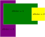

# Sprite System

The [`SpriteSystem`](../../reference/classes/spritesystem) allows rendering
world objects - with positions and scales in world space rather than the
[`UISystem`](../../reference/classes/uisystem) which operates in camera space.

## Setting up the Sprite System

To set up a [`SpriteSystem`](../../reference/classes/spritesystem), you simply
need to provide a message bus.

```typescript
new SpriteSystem(messageBus);
```

## Peer dependencies

The [`SpriteSystem`](../../reference/classes/spritesystem) will only work in
conjunction with some kind of rendering system, such as the
[`WebGLSystem`](../../reference/classes/webglsystem) to actually render the
elements; the [`SpriteSystem`](../../reference/classes/spritesystem) is a
pre-rendering system.

## Creating an entity with a sprite

An [`Entity`](../../reference/classes/entity) can be given a sprite by adding
the [`Sprite`](../../reference/classes/sprite) component to an entity.

```typescript
const spriteEntity = new Entity(messageBus);
spriteEntity.Add(new Transform(new Vector(0, 0), new Vector(5,5)));
spriteEntity.Add(new Sprite(new Color(1, 1, 1, 1), {
    bounds: Polygon.RectangleByDimensions(1, 1),
    texture: new Texture("example_texture", Polygon.RectangleByPoints(new Vector(0,0), new Vector(1,1)).GetFloat32Array())
}));
```
This example shows creating an [`Entity`](../../reference/classes/entity) which
will use the [`Sprite`](../../reference/classes/sprite) component to render
using the `example_texture` texture.

## Z Order

Sprites contain a field [`zOrder`](../../reference/classes/sprite#zorder), which
determines the precendence with which sprites will appear on the screen. Objects
with a higher z order will appear ahead of objects with a lower z order.



## Textures

Sprites can optionally include a [`Texture`](../../reference/classes/texture),
if no [`Texture`](../../reference/classes/texture) is provided the colour
provided will simply be rendered instead.

## Creating a UI element

A UI element can be created by adding a [`UI`](../../reference/classes/ui)
component to an entity, alongside required
[`Transform`](../../reference/classes/transform) and
[`Sprite`](../../reference/classes/sprite) components.

```typescript
const gameCamera = new Entity(messageBus);
gameCamera.Add(new Transform(new Vector(0, 0), new Vector(5, 5)));
gameCamera.Add(new Camera());

const uiElement = new Entity(messageBus);
uiElement.Add(new Transform(new Vector(0, 0), new Vector(0.2,0.2)));
uiElement.Add(new Sprite(new Color(1, 1, 1, 1), {
    bounds: Polygon.RectangleByDimensions(1, 1),
    texture: new Texture("example_texture", Polygon.RectangleByPoints(new Vector(0,0), new Vector(1,1)).GetFloat32Array())
}));
uiElement.Add(new UI(gameCamera));
```

This example shows creating a camera, and then a UI element that will display in
the center of the camera - with the `example_texture` texture.

## UI layout


The UI uses a coordinate system relative to the camera it is assigned to. All of
the UI layout is through the [`Transform`](../../reference/classes/transform)
component, which is interpreted differently for UI elements.  

### Position
The coordinates go from `(-1,-1)` (bottom left) to `(1,1)` (top right). This
results in the center of the camera being marked by position `(0,0)`. To put a
UI element a quarter along the screen, as shown here:


This UI element would be at position `(0.5,0)`.
```typescript
new Transform(new Vector(0.5, 0));
```

### Scale

The scale of UI elements is relative to the camera's viewport - meaning that a
scale of `(1,1)` would result in a UI element that takes up the entire screen,
while a scale of `(0.5,0.5)` would be half the size of the screen vertically and
horizontally. Keep in mind that this UI scale system is affected by the aspect
ratio of the camera, and as such the aspect ratio should be accounted for when
specifying scale dimensions, otherwise the scale may be distorted or stretched
in an unwanted way.

### Rotation

The rotation works exactly the same way as a normal world object, through the
[`Transform`](../../reference/classes/transform) component. The orientation is
determined in radians.

## UI cameras

When adding a UI component, you must specify the camera that the UI will be
rendered on. The UI element will exclusively be rendered on this camera, and all
calculations of scale and positions will be relative to it.