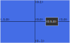

# UI System

The [`UISystem`](../../reference/classes/uisystem) allows rendering UI elements in camera space, rather than world space. This can be used for making menus, HUDs, notifications etc.

## Setting up the UI System

To set up a [`UISystem`](../../reference/classes/uisystem), you simply need to provide a message bus.

```typescript
new PointerSystem(messageBus);
```

## Peer dependencies

The [`UISystem`](../../reference/classes/uisystem) will only work in conjunction with some kind of rendering system, such as the [`WebGLSystem`](../../reference/classes/webglsystem) to actually render the UI elements; the [`UISystem`](../../reference/classes/uisystem) is a pre-rendering system.

## Creating a UI element

A UI element can be created by adding a [`UI`](../../reference/classes/ui) component to an entity, alongside required [`Transform`](../../reference/classes/transform) and [`Sprite`](../../reference/classes/sprite) components.

```typescript
const gameCamera = new Entity(messageBus);
gameCamera.Add(new Transform(new Vector(0, 0), new Vector(5, 5)));
gameCamera.Add(new Camera());

const uiElement = new Entity(messageBus);
uiElement.Add(new Transform(new Vector(0, 0), new Vector(0.2,0.2)));
uiElement.Add(new Sprite(new Color(1, 1, 1, 1), {
    bounds: Polygon.Rectangle(1, 1),
    texture: new Texture("example_texture", new Polygon([new Vector(0, 0), new Vector(1, 0), new Vector(1, 1), new Vector(0, 1)]).GetFloat32Array())
}));
uiElement.Add(new UI(gameCamera));
```

This example shows creating a camera, and then a UI element that will display in the center of the camera - with the `example_texture` texture.

## UI layout


The UI uses a coordinate system relative to the camera it is assigned to. All of the UI layout is through the [`Transform`](../../reference/classes/transform) component, which is interpreted differently for UI elements.  

### Position
The coordinates go from `(-1,-1)` (bottom left) to `(1,1)` (top right). This results in the center of the camera being marked by position `(0,0)`. To put a UI element a quarter along the screen, as shown here:



This UI element would be at position `(0.5,0)`.
```typescript
new Transform(new Vector(0.5, 0));
```

### Scale

The scale of UI elements is relative to the camera's viewport - meaning that a scale of `(1,1)` would result in a UI element that takes up the entire screen, while a scale of `(0.5,0.5)` would be half the size of the screen vertically and horizontally. Keep in mind that this UI scale system is affected by the aspect ratio of the camera, and as such the aspect ratio should be accounted for when specifying scale dimensions, otherwise the scale may be distorted or stretched in an unwanted way.

### Rotation

The rotation works exactly the same way as a normal world object, through the [`Transform`](../../reference/classes/transform) component. The orientation is determined in radians.

## UI cameras

When adding a UI component, you must specify the camera that the UI will be rendered on. The UI element will exclusively be rendered on this camera, and all calculations of scale and positions will be relative to it.