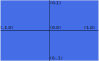

# UI

UI elements can be created by adding a [UI] component to an entity, changing how
the entities [Transform] is interpreted, which will be in camera space rather
than world space.

## UI layout



The UI uses a coordinate system relative to the camera it is assigned to. All of
the UI layout is through the [Transform] component, which is interpreted
differently for UI elements. 

### Position
The coordinates go from `(-1,-1)` (bottom left) to `(1,1)` (top right). This
results in the center of the camera being marked by position `(0,0)`. To put a
UI element a quarter along the screen, as shown here:


This UI element would be at position `(0.5,0)`.
```typescript
new Transform(new Vector(0.5, 0));
```

### Scale

The scale of UI elements is relative to the camera's viewport - meaning that a
scale of `(1,1)` would result in a UI element that takes up the entire screen,
while a scale of `(0.5,0.5)` would be half the size of the screen vertically and
horizontally. Keep in mind that this UI scale system is affected by the aspect
ratio of the camera, and as such the aspect ratio should be accounted for when
specifying scale dimensions, otherwise the scale may be distorted or stretched
in an unwanted way.

### Rotation

The rotation works exactly the same way as a normal world object, through the
[Transform] component. The orientation is determined in radians.

## UI cameras

When adding a UI component, you must specify the camera that the UI will be
rendered on. The UI element will exclusively be rendered on this camera, and all
calculations of scale and positions will be relative to it.

[UI]:../../reference/classes/ui
[Transform]:../../reference/classes/transform